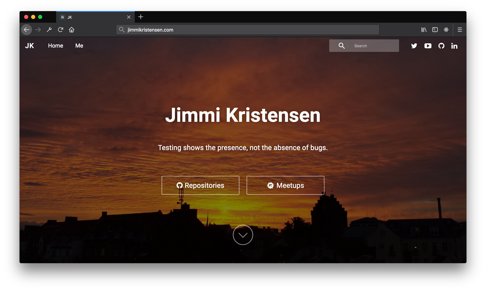
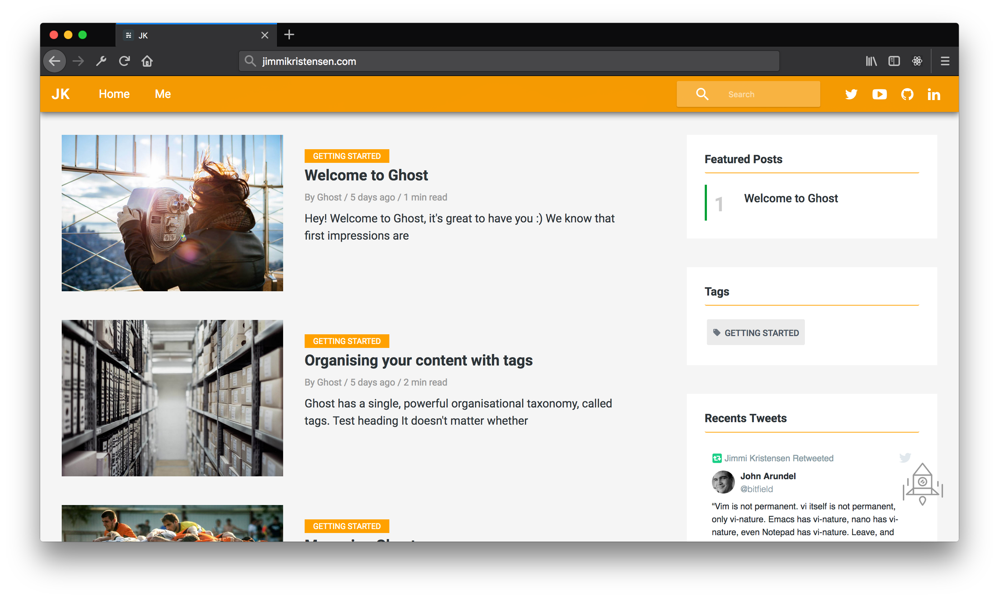

# Raccoon for [Ghost](https://github.com/tryghost/ghost/)

[](https://ghost.org/)
[](https://nodejs.org/en/)

> Minimalist Material Design and Elegant theme for [Ghost](https://github.com/tryghost/ghost/)




## Raccoon Support for Web Browsers

Raccoon supports the following web [browsers](http://caniuse.com/#search=flexbox)

## Featured

- Responsive layout
- Blog navigation
- Home title Typed style
- Page 404 (Multiple faces emoticons)
- Page subscribe
- Pagination Infinite Scroll
- Cover images for blog, tag and author
- links to followers in social media
- Related Articles (6 articles)
- Template (Video Post Format)
- Teamplate (Image post Format)
- Template (Audio post Format)
- AMP Template (Accelerated Mobile Pages)
- 5 articles featured in the home of the page section sidebar
- 5 articles latest posts in the (author - tag - post) section sidebar
- 10 Tags in the sidebar
- Support for comments (Facebook or Disqus)
- Support for counter comments (Facebook or Disqus)
- Buttons to share the article
- YouTube, Vimeo, kickstarter, dailymotion, vid.me -> Video Responsive
- YouTube Subscribe Button => Video Post Format
- Facebook widget in sidebar
- Twitter widget in sidebar
- Code syntax [Prismjs](http://prismjs.com/index.html) Supported all syntax.

## Ghost settings

- Enable **all** checkboxes on the labs page in your Ghost admin panel.


## Raccoon settings

### Social Links

Add the Social Links only for the services you want to appear in the header section of your website. Pay attention as enabling too many services will cause menu problems.

### YouTube Subscribe Button

This section enables the YouTube Post format. Add the Channel Name and Channel ID which can be found here [YouTube Advanced Settings](https://www.youtube.com/account_advanced)

— Copy the below script to `Settings -> Code Injection  -> Blog Footer section`

```html
<script>
/*====================================================
  THEME SETTINGS & GLOBAL VARIABLES
====================================================*/

/* 01. Social Media Follow */
var followSocialMedia = {
  'google': 'https://...',
  'youtube': 'https://...',
  'instagram': 'https://...',
  'snapchat': 'https://...',
  'dribbble': 'https://...',
  'github': 'https://...',
  'linkedin':'https://...',
  'spotify':'https://...',
  'codepen':'https://...',
  'behance':'https://...',
  'flickr':'https://...',
  'pinterest':'https://...',
  'telegram':'https://...',
  'feed':'https://...',
};

/* 02. Title for home Page */
var homeTitle = '... your title ...';

/* if you want to have the title style typed
ignore homeTitle and add this code */
var homeTitleTyped = ['YOUR TITLE 1', 'YOUR TITLE 2', 'YOUR TITLE 3', 'YOUR TITLE 4'];

/* 03. Home screen buttons */
var homeScreenButtons = [
    {
    	name: 'Repositories',        /* Link text */
        url: 'https://github.com/jimmikristensen?tab=repositories', /* Link */
        class: 'github-content', /* optional - class used to set content icon */
        target: '_blank',        /* optional - link target*/
        title: 'My Repositories' /* optional - link title */
    },
    {
    	name: 'Meetups',    
        url: 'https://www.meetup.com/FLUG-Fyns-Linux-User-Group/', 
        class: 'meetup-content', 
        target: '_blank',        
        title: 'FLUG Meetups'    
    }
];

/* 04. Youtube button subscribe for Video Post Format */
var youtubeChannelName = 'YOUR_CHANNEL_NAME';
var youtubeChannelID = 'YOUR_CHANNEL_ID';

/* 05. Disqus Comment Settings */
var disqusShortName = 'YOUR_DISQUS_SHORTCUT_HERE';

/* 06. Facebook Widget Settings */
var fansPageName = 'YOUR_FANS_PAGE_NAME';

/* 07. Twitter Widget Settings */
var twitterUserName = 'YOUR_TWITTER_NAME';
var twitterNumber = 2;

/* 08. GitHub Widget Settings */
var githubUsername = 'jimmikristensen';
var reposToDisplay = 5;
</script>

<!-- Disqus Comments Count-->
<script id="dsq-count-scr" src="//YOUR_DISQUS_SHORTCUT_HERE.disqus.com/count.js" async></script>
```

### Home Screen Buttons

You can add an array of home screen buttons by adding them to the _homeScreenButtons_ variable.

- name: is the text that will appear on the button.
- url: is the URL of the link button.
- class: is the name of the css class that will contain the FontAwesome icon - see below (optional).
- target: is the link target (optional).
- title: is the link title (optional).

#### Adding a FontAwesome icon to the Home Screen Buttons

You can use any [FontAwesome](http://fontawesome.io/icons/) fonts as an icon for the Home Screen Buttons by inserting the Unicode for the icon into the _content_ of a css class.
The name of the css class should be referenced by then _class_ attribute of the Home Screen Button settings above.

- The styling needs to be added to the header section `Settings -> Code Injection  -> Blog Header section`

```html
<style>
.github-content::before {
  content: "\f09b";
}
.meetup-content::before {
  content: "\f2e0";    
}
</style>
```

### GitHub Widget Settings

To display GitHub repositories as a widget on the sidebar, set the _githubUsername_ variable to the GitHub username of which you want to display repos for. The repo list is sorted by latest pushed. To limit the number of repos that are shown, set the _reposToDisplay_ variable to an integer.

### Facebook Comments

To use facebook comments, skip the configuration Disqus.

This enables comments and comment counter

— Add the code `Settings -> Code Injection -> Blog Footer`

```html
  <div id="fb-root"></div>
  <script>(function(d, s, id) {
    $('.mapache-facebook').removeClass('u-hide');
    var js, fjs = d.getElementsByTagName(s)[0];
    if (d.getElementById(id)) return;
    js = d.createElement(s); js.id = id;
    js.async=true;
    js.src = 'https://connect.facebook.net/en_US/sdk.js#xfbml=1&version=v2.11';
    fjs.parentNode.insertBefore(js, fjs);
  }(document, 'script', 'facebook-jssdk'));</script>
```

## Change Theme Style

To change the color of the Raccoon theme select one of the theme styles below and copy it into the Setting -> Code Injection -> Blog Header

```html
<!-- Theme orange -->
<link rel="stylesheet" href="/assets/styles/theme-orange.css"/>
<!-- Theme indigo -->
<link rel="stylesheet" href="/assets/styles/theme-indigo.css"/>
<!-- Theme dark blue -->
<link rel="stylesheet" href="/assets/styles/theme-dark-blue.css"/>
<!-- Theme blue semi dark -->
<link rel="stylesheet" href="/assets/styles/theme-blue-semi-dark.css"/>
<!-- Theme blue -->
<link rel="stylesheet" href="/assets/styles/theme-blue.css"/>
<!-- Theme Grey -->
<link rel="stylesheet" href="/assets/styles/theme-grey.css"/>
<!-- Theme dark cyan -->
<link rel="stylesheet" href="/assets/styles/theme-dark-cyan.css"/>
<!-- Theme purple -->
<link rel="stylesheet" href="/assets/styles/theme-purple.css"/>
<!-- Theme teal -->
<link rel="stylesheet" href="/assets/styles/theme-teal.css"/>
<!-- Theme Green -->
<link rel="stylesheet" href="/assets/styles/theme-green.css"/>

<!-- For theme white add two-color logo 230px * 130px -->

<!--
  ***** 230px *****
  *               *
  ***************** 130px
  *               *
  *****************
-->


<link rel="stylesheet" href="/assets/styles/theme-white.css"/>
```


### Add additional content to the sidebar

Add your own custom content into the side bar by editing the `./partials/sidebar.hbs` file.

```html
<!-- Add your content to the bottom -->
<div class="sidebar-items">
  <div class="sidebar-title">...your title...</div>
  ... your content ...
</div>
```

### Warning - Note - Success

Add some more styling options to your articles text with these three styles.

```html
<p class="warning"> ... your text warning ... </p>

<p class="note"> ... your text note ... </p>

<p class="success"> ... your text success ... </p>
```


### PrismJS code syntax

Make your code stand out. WIth the PrismJS code highlighter. PrismJS allows you to select which languge you embeded and performs code highlighting according to the language. Neat!

Take a look at the [Prismjs Supported Language List](http://prismjs.com/#languages-list)

 to find your coding language.

## Template for (Video - Image - Audio)

**Image** — The Featured image will become large in size.

**Video** — The first video in the article will be large in size. Supports formats

- vimeo
- Dailymotion
- Youtube
- Vid
- kickstarter

**Audio** — The first Audio in the article will be large in size. Supports formats

- Soundcloud
- Mixcloud
- Spotify

> Add video or Audio where convenient. When you change the theme you will not have problems and not have Problem in your AMP Template


### Credits

- [Hodor AMP Template](https://github.com/godofredoninja/Hodor-AMP-Template-for-Ghost)
- [Typed](https://github.com/mattboldt/typed.js/)
- [Normalize](https://necolas.github.io/normalize.css/)
- [Jquery.ghostHunter](https://github.com/jamalneufeld/ghostHunter)
- [Prismjs](http://prismjs.com/)
- [theia-sticky-sidebar](https://github.com/WeCodePixels/theia-sticky-sidebar)
- [jquery-lazyload](http://www.appelsiini.net/projects/lazyload)

## Copyright & License

Copyright (c) 2016 @GodoFredoNinja - Released under the [MIT license](LICENSE).
